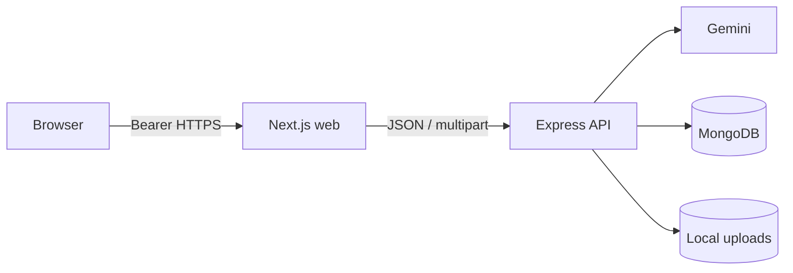
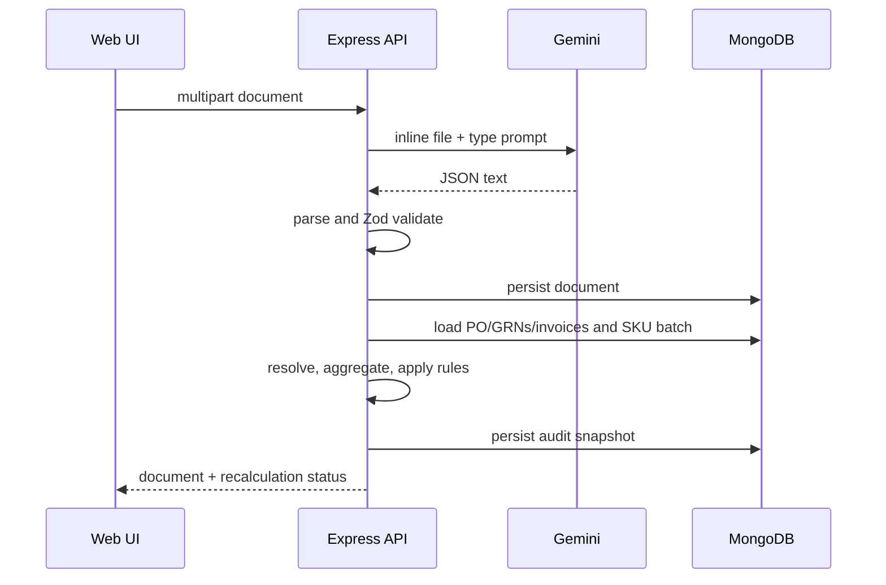

# Architecture

## Components

- **Web:** Next.js App Router UI, auth state, Axios transport, TanStack Query cache.
- **API:** Express routes, Zod validation, domain services, repositories, and Mongoose models.
- **Parsing:** Gemini receives inline PDF/image content and a document-specific prompt.
- **Data:** MongoDB stores SKU masters, parsed documents, and immutable match audits.

## Request and authentication flow

Login returns the configured static token. The web stores it in guarded local storage, validates it
through `/api/auth/validate`, and adds it as a bearer header. API middleware compares it in
constant-time where practical. A 401 clears auth and query state.

## Upload and matching flow

Deletion removes the document/file and then attempts the same recomputation. A computation failure
does not undo a successful upload or delete.

## Data model

`SkuMaster` has normalized unique ERP/EAN identifiers. Purchase orders, GRNs, and invoices retain
validated parsed lines and private file metadata. `MatchAudit` stores public-safe document
references, reasons, aggregated items, totals, trigger, and computation timestamp. Associations use
normalized PO numbers; public serializers omit normalized fields, paths, stored names, raw parser
data, and Mongoose internals.

## Query and cache flow

Shared contracts type API responses. TanStack Query keys identify summary, documents, SKUs, match,
and history. Mutations invalidate dependent keys; upload/delete refresh documents, summary, and the
affected PO match. The server remains authoritative for matching.
